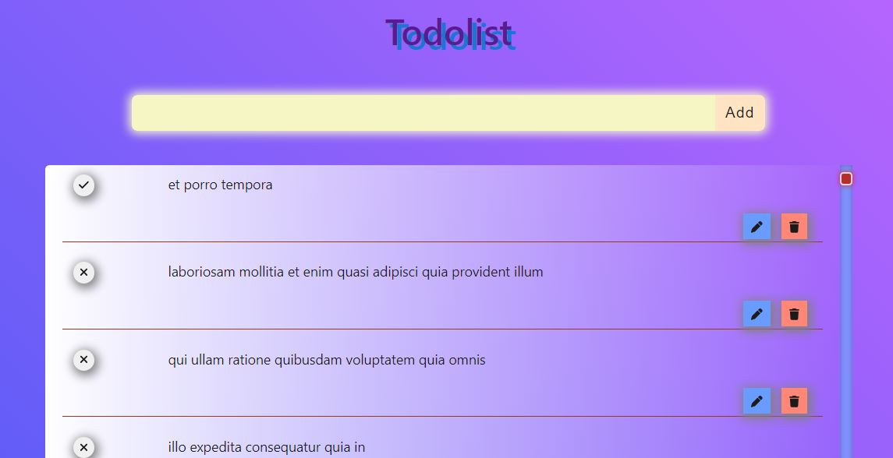

# To-Do List Redux

Welcome to the React Redux To-Do List application! This project is built using the React framework for the frontend and Redux for state management, offering a seamless user experience for managing to-do items. With the power of React's virtual DOM and Redux's centralized state management, users can perform CRUD (Create, Read, Update, Delete) operations without any page reloading.(__see "Dummy API Features" at bottom__)

## Demo :- __  [Click to see demo on Youtube](https://www.youtube.com/watch?v=wQxEFFrNWbM) __

## Features

- **Effortless CRUD Operations**: Enjoy smooth and intuitive creation, reading, updating, and deletion of to-do items without experiencing any interruptions or page reloads.
- **API Integration**: Utilizing the `jsonplaceholder` API, the application fetches initial to-do data, allowing for seamless integration and testing.
- **React Framework**: Leveraging React's component-based architecture, the UI is designed to be modular, reusable, and easy to maintain.
- **Redux State Management**: With Redux, the application ensures a predictable state flow, centralizing data and logic for efficient management and manipulation of to-do items.

## Steps for Working Todo List

[Click to see demo on Youtube](https://www.youtube.com/watch?v=wQxEFFrNWbM)

1. **Add Todo Functionality**:
 
   - When the user enters a todo item in the input box and clicks the "Add" button, the todo item gets added to the list of todos at top.

  
2. **Update Todo Functionality**:
  
   - When the user clicks the "Update" button next to a todo item,  "Add" button changes to "Update".
   - The input box gets populated with the text of the todo item being updated.
   - When the user clicks the "Update" button again, todo item gets updated.

4. **Delete Todo Functionality**:
   - When the user clicks the "Delete" button next to a todo item,  todo item gets removed from the list of todos.

5. **Toggle Completed State**:
  
   - When the user clicks the checkbox next to a todo item,  the  item's completed state gets toggled between true and false.

   ## Management of Todo State**:
   - Used Redux to manage the state of the todo list application.
   - Stored the list of todo items in the Redux store.
   - Implemented Redux actions and reducers to add, update, delete, and toggle the completed state of todo items.

## Getting Started

To get started with the React Redux To-Do List, simply follow the steps below:

1. Clone the repository to your local machine.
2. Install the necessary dependencies by running `npm install`.
3. Start the development server with `npm start`.
4. Explore the application and enjoy managing your to-do items seamlessly!

## API Integration

The React Redux To-Do List application utilizes the `jsonplaceholder` API for fetching initial to-do data. You can find more information about this API [here](https://jsonplaceholder.typicode.com/todos).

## Contributing

Contributions are welcome! If you find any issues or have suggestions for improvements, please feel free to open an issue or create a pull request.

# Note 
Internet connection must be on.

While reloading you get page refreshed because of API unedit feature (see below the dummy feature).

## Dummy API Features

1. **Fetch and Show Todo Items**:
   - Fetch todo items from the provided API endpoint: [https://jsonplaceholder.typicode.com/todos](https://jsonplaceholder.typicode.com/todos).
   - Display the fetched todo items in the application UI.(__Only fetch gives actual data__)

2. **Add a Todo Item**:
   - Implement functionality to add a new todo item.
   - Upon adding a new todo item, make a POST request to the API endpoint mentioned above.
   - Save the added todo item in the React application state.
   - Note: The __POST request is a dummy request and won't actually add the item to the server__. However, it will simulate a valid request and return dummy data.

3. **Update a Todo Item**:
   - Implement functionality to update an existing todo item.
   - When updating a todo item, make a PUT request to the API endpoint mentioned above.
   - Note: Similar to adding a todo item, the __PUT request__ is a __dummy call__ and __won't update the item on the server__. It will return dummy data.

4. **Delete a Todo Item**:
   - Implement functionality to delete a todo item.
   - When deleting a todo item, make a DELETE request to the API endpoint mentioned above.
   - Note: Like the other operations, the __DELETE request__ is a __dummy call__ and __won't actually delete the item from the server__. It will return dummy data.

These features allow for simulating CRUD operations (Create, Read, Update, Delete) with the provided API endpoint, enabling users to interact with the todo list application as if it were connected to a real backend.

